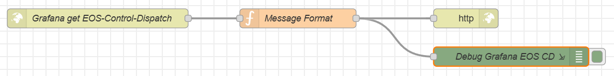
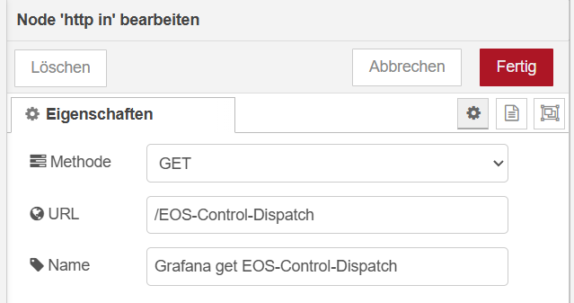
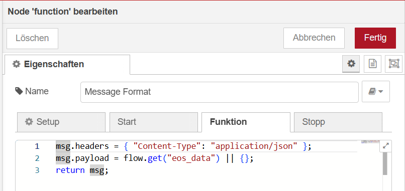
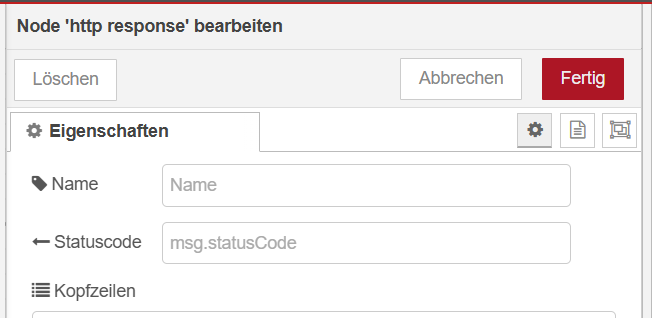

% SPDX-License-Identifier: Apache-2.0
(adapter-nodered-page)=

# Node-RED Adapter

The Node-RED adapter provides a **bidirectional interface** between
**NodeRED** and the **Akkudoktor-EOS (EOS)** energy optimisation system.

It allows EOS to:

* **Provide** control instructions via HTTP-IN Node
* **Receive** measurements and device states via Node-RED
  (The HTTP-IN Node "eos_data_acquisition" is NOT yet functional)

This adapter enables a handover of the EOS control instructions (EV, battery & home appliance) 
for the current timeslot via Node-RED to any desired integration,
while keeping EOS **device simulations and optimisation
logic decoupled from other implementations**.

## 1. Exchanging data between EOS and Node-RED

### Basic concept

EOS **receives** e.g. measurements via HTTP-IN by Node-RED before each energy management run.
(The HTTP-IN Node "eos_data_acquisition" is NOT yet functional)

EOS **provides control instructions** via HTTP-IN to Node-RED after each optimisation run.

Typical use cases with Node-RED:

* optimal for heterogeneous systems
* Automations and scripts
* Device or manufacturer integrations
* Debugging and validation

### Configuration steps in EOS

#### 1. Enable and configure the Node-RED adapter

EOS must be configured with access to the Node-RED instance in Config->adapter.
* prerequisite is an already installed and running Node-RED instance
* adapter.nodered.host: 192.168.1.109 (example IP of your Node-RED instance)
* adapter.nodered.port: 1880 (default)
* adapter.provider: ["NodeRED"]

#### 2. Run energy optimisation

Before the run, EOS receives:
* EOS receives measurement values via HTTP-IN "eos_data_acquisition" before optimisation.
  (The HTTP-IN Node "eos_data_acquisition" is NOT yet functional)

After the run, EOS provides:
* The device instruction and solution entities for the current time slot via HTTP-IN "Control Dispatch".

### Configuration steps in NodeRED

#### 1. Create Node-RED flow with nodes for processing

* EOS Control Disptach

## 2. Data obtained *from EOS*

### 2.1 Device instruction (Control Dispatch)

After each energy optimisation run, EOS produces **device instructions** for the
controlled resources.

E.g.:
`{"battery1_op_mode":"SELF_CONSUMPTION","battery1_op_factor":1,"ev11_op_mode":"IDLE","ev11_op_factor":1,"homeappliance1_op_mode":"RUN","homeappliance1_op_factor":1}`

* The **entity state** represents the device's selected **operation mode**.
* **Entity attributes** provide additional parameters for the operation mode, such as:

  * `operation_mode_factor`
  * Power or rate limits
  * Mode-specific control parameters

## 3. Data retrieved by EOS via Node-RED

"Under construction".

## 4. Further processing of EOS data

Once published, EOS data can be used in any needed scenario:

* Used as triggers or conditions in automations
* Mapped to device-specific services or integrations
* Visualised in dashboards
* Compared with measured values for monitoring and validation

EOS does **not** directly control devices.
It provides **structured optimisation results**, while your tool of choice remains
responsible for executing the actual control actions.

### Summary

* **EOS** focuses on **forecasting, simulation, and optimisation**
* **Node-RED** can focus on **moving, processing, integration and execution**

The Node-RED adapter provides a structured interface between EOS and a heterogeneous environment,
allowing flexible integration without coupling EOS to device specifics.
