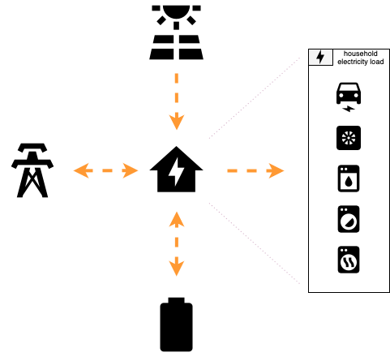
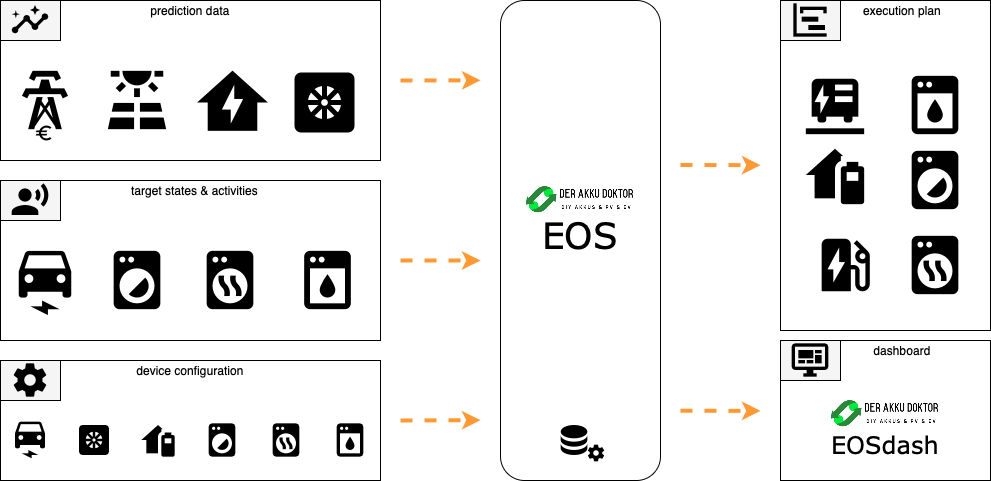
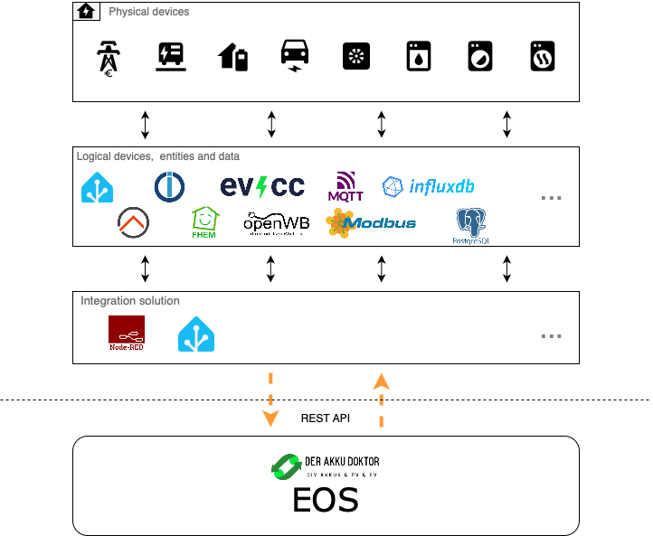

% SPDX-License-Identifier: Apache-2.0

# Introduction

The Energy System Simulation and Optimization System (EOS) provides a comprehensive
solution for simulating and optimizing an energy system based on renewable energy
sources. With a focus on photovoltaic (PV) systems, battery storage (batteries), load
management (consumer requirements), heat pumps, electric vehicles, and consideration of
electricity price data, this system enables forecasting and optimization of energy flow
and costs over a specified period.

After successfully installing a PV system with or without battery storage, most owners
first priority is often to charge the electric car with surplus energy in order to use
the electricity generated by the PV system cost-effectively for electromobility.

After initial experiences, the desire to include battery storage and dynamic electricity
prices in the solution soon arises. The market already offers various commercial and
non-commercial solutions for this, such as the popular open source hardware and software
solutions evcc or openWB.

Some solutions take into account the current values ​​of the system such as PV power
output, battery storage charge level or the current electricity price to decide whether
to charge the electric car with PV surplus or from the grid (e.g. openWB), some use
historical consumption values ​​and PV forecast data for their calculations, but leave out
the current electricity prices and charging the battery storage from the power grid
(Predbat). Others are specialiced on working in combination with a specific smart home
solution (e.g. emhass). Still others focus on certain consumers, such as the electric car,
or are currently working on integrating the forecast values ​​(evcc). And some are commercial
devices that require an electrician to install them and expect a certain ecosystem
(e.g. Sunny Home Manager).

The Akkudoktor EOS

- takes into account historical, current and forecast data such as consumption values, PV
  forecast data, electricity price forecast, battery storage and electric car charge levels
- the simulation also takes into account the possibility of charging the battery storage
  from the grid at low electricity prices
- is not limited to certain consumers, but includes electric cars, heat pumps or more
  powerful consumers such as tumble dryers
- is independent of a specific smart home solution and can also be integrated into
  self-developed solutions if desired
- is a free and independent open source software solution

The challenge is to charge (electric car) or start the consumers (washing machine, dryer)
at the right time and to do so as cost-efficiently as possible. If PV yield forecast,
battery storage and dynamic electricity price forecasts are included in the calculation,
the possibilities increase, but unfortunately so does the complexity.

The Akkudoktor EOS addresses this challenge by simulating energy flows in the household
based on target values, forecast data and current operating data over a 48-hour
observation period, running through a large number of different scenarios and finally
providing a cost-optimized plan for the current day controlling the relevant consumers.

## Prerequisites

- Technical requirements
- Input data

### Technical requirements

- reasonably fast computer on which EOS is installed
- controllable energy system consisting of photovoltaic system, solar battery storage,
  energy intensive consumers that must provide the appropriate interfaces
- integration solution for integrating the energy system and EOS

### Input Data

The EOS requires various types of data for the simulation:

Forecast data

- PV yield forecast
- Expected household consumption
- Electricity price forecast
- Forecast temperature trend (if heatpump is used)

Basic data and current operating data

- Current charge level of the battery storage
- Value of electricity in the battery storage
- Current charge level of the electric car
- Energy consumption and running time of dishwasher, washing machine and tumble dryer

Target values

- Charge level the electric car should reach in the next few hours
- Consumers to run in the next few hours

There are various service providers available for PV forecasting that calculate forecast
data for a PV system based on the various influencing factors, such as system size,
orientation, location, time of year and weather conditions. EOS also offers a
[PV forecasting service](#prediction-page) which can be used. This service uses
public data in the background.

For the forecast of household consumption EOS provides a standard load curve for an
average day based on annual household consumption that you can fetch via API. This data
was compiled based on data from several households and provides an initial usable basis.
Alternatively your own collected historical data could be used to reflect your personal
consumption behaviour.

## Simulation Results

Based on the input data, the EOS uses a genetic algorithm to create a cost-optimized
schedule for the coming hours from numerous simulations of the overall system.

The plan created contains for each of the coming hours

- Control information
  - whether and with what power the battery storage should be charged from the grid
  - when the battery storage should be charged via the PV system
  - whether discharging the battery storage is permitted or not
  - when and with what power the electric car should be charged
  - when a household appliance should be activated
- Energy history information
  - Total load of the house
  - Grid consumption
  - Feed-in
  - Load of the planned household appliances
  - Charge level of the battery storage
  - Charge level of the electric car
  - Active losses
- Cost information
  - Revenue per hour (when fed into the grid)
  - Total costs per hour (when drawn from the grid)
  - Overall balance (revenue-costs)
  - Cost development

If required, the simulation result can also be created and downloaded in graphical
form as a PDF from EOS.

## Integration

The Akkudoktor EOS can be integrated into a wide variety of systems with a variety
of components.

However, the components are not integrated by the EOS itself, but must be intergrated by
the user using an integration solution and currently requires some effort and technical
know-how.

Any [integration](#integration-page) solution that can act as an intermediary between the
components and the REST API of EOS can be used. One possible solution that enables the
integration of components and EOS is Node-RED. Another solution could be Home Assistant
usings its built in features.

Access to the data and functions of the components can be done in a variety of ways.
Node-RED offers a large number of types of nodes that allow access via the protocols
commonly used in this area, such as Modbus or MQTT. Access to any existing databases,
such as InfluxDB or PostgreSQL, is also possible via nodes provided by Node-RED.

It becomes easier if a smart home solution like Homa Assistant, openHAB or ioBroker or
solutions such as evcc or openWB are already in use. In this case, these smart home
solutions already take over the technical integration and communication with the components
at a technical level and Node-RED offers nodes for accessing these solutions, so that the
corresponding sources can be easily integrated into a flow.

In Home Assistant you could use an automation to prepare the input payload for EOS and
then use the RESTful integration to call EOS. Based on this concept there is already a
home assistand add-on created by [Duetting](#duetting-solution).

The plan created by EOS must also be executed via the chosen integration solution,
with the respective devices receiving their instructions according to the plan.

## Limitations

The plan calculated by EOS is cost-optimized due to the genetic algorithm used, but not
necessarily cost-optimal, since genetic algorithms do not always find the global optimum,
but usually find good local optima very quickly in a large solution space.

## Links

- [German Video explaining the basic concept and installation process for the early version of EOS (YouTube)](https://www.youtube.com/live/ftQULW4-1ts?si=oDdBBifCpUmiCXaY)
- [German Forum of Akkudoktor EOS](https://akkudoktor.net/c/der-akkudoktor/eos)
- [Akkudoktor-EOS GitHub Repository](https://github.com/Akkudoktor-EOS/EOS)
- [Latest EOS Documentation](https://akkudoktor-eos.readthedocs.io/en/latest/)
