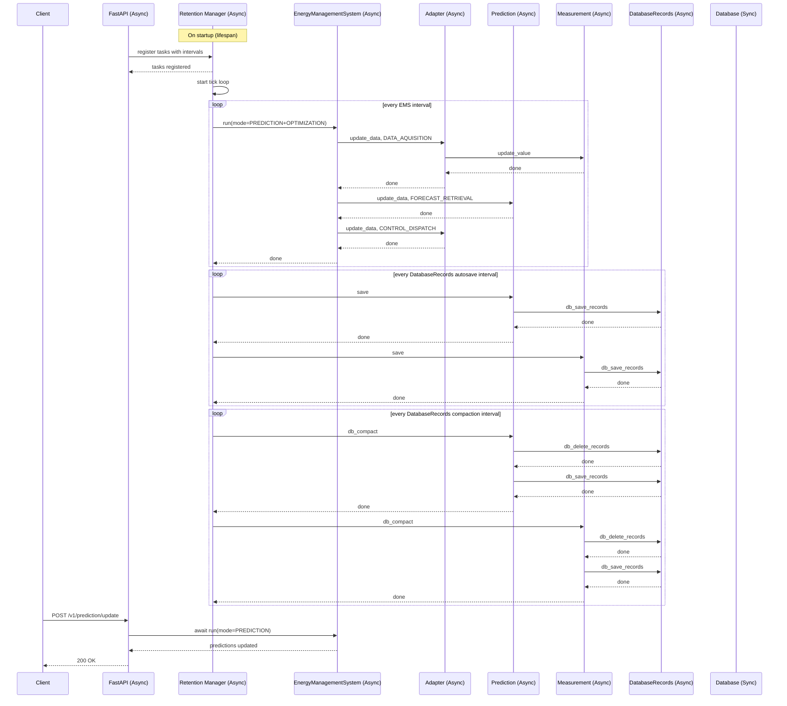

# Asynchronous Design of Akkudoktor‑EOS

The Akkudoktor‑EOS server is built on **FastAPI** and is transitioning to a fully asynchronous
design to improve scalability, responsiveness, and resource utilisation, especially for
long‑running or I/O‑bound operations.
The server manages a variety of background tasks through a central **Retention Manager**, which
schedules and supervises all periodic and asynchronous work.

## Core Asynchronous Components

- **FastAPI REST Interface**
  All HTTP endpoints are defined as `async def` handlers (or synchronous where no I/O waiting is
  required), allowing the server to handle many concurrent connections without blocking the event
  loop.

- **Retention Manager**
  A dedicated component responsible for orchestrating all background tasks. It runs an asynchronous
  tick loop that executes registered functions at configurable intervals. The manager also provides
  graceful shutdown handling, waiting for in‑flight jobs to finish.

<!-- pyml disable line-length -->
- **Managed Asynchronous Tasks**
  The following tasks are registered with the Retention Manager and run periodically:

  | Task Name | Function | Interval Configuration | Description |
  |-----------|----------|------------------------|-------------|
  | `supervise_eosdash` | `supervise_eosdash` | `server/eosdash_supervise_interval_sec` | Monitors and restarts the EOSdash UI process if needed. |
  | `autosave_config` | `autosave_config` | `general/config_save_interval_sec` | Saves the current configuration to disk automatically. |
  | `cache_clear` | `cache_clear` | `cache/cleanup_interval` | Removes expired entries from the cache. |
  | `save_eos_database` | `save_eos_database` | `database/autosave_interval_sec` | Persists in‑memory measurement and prediction data to the database. |
  | `compact_eos_database` | `compact_eos_database` | `database/compaction_interval_sec` | Compacts and vacuums the database to reclaim space and improve performance. |
  | `manage_energy` | `ems_manage_energy` | `ems/interval` | Core energy management loop: triggers predictions, optimisation, and device control. |

  The `manage_energy` task is the central orchestrator that itself calls asynchronous prediction
  updates, adapter scheduling and optimisation runs. It uses the `EnergyManagementSystem`
  (`get_ems()`) which internally manages concurrency to ensure only one energy management run
  happens at a time.
<!-- pyml enable line-length -->

- **On‑Demand Asynchronous Endpoints**
  Several REST endpoints are asynchronous and delegate heavy work to the `EnergyManagementSystem`.
  Examples include:
  - `POST /v1/prediction/update` – updates all prediction providers asynchronously.
  - `POST /optimize` – runs a genetic optimisation (deprecated, but still async).
  - `POST /v1/admin/server/restart` – spawns a new process and schedules a shutdown task.

## Asynchronous Workflow

The diagram below shows how periodic tasks are registered and executed by the Retention Manager,
and how a client request can trigger an asynchronous update.

For server shutdown or restart, the Retention Manager’s task is cancelled, and the server waits
for in‑flight jobs to finish (shutdown timeout = 10 seconds). The state is saved via
`save_eos_state()`.

## Asynchronous vs. Synchronous

- **REST endpoints** that perform I/O or heavy computation are `async def`.
- **Retention Manager** uses `asyncio.create_task()` to run the tick loop and individual task
  executions.
- **Database** that synchronizes database access is `async def`, but the database backends
  **DataBaseBackendABC** are synchronous.
- **DatabaseRecordProtocolMixin** provides asynchronous access to in memory data records and
  database storage.
- **Prediction** and **Measurement** provide asynchronous access to the undelying database using
  the **DatabaseRecordProtocolMixin**.
- **Energy management runs** are serialised using an internal lock (via `EMS.run()`) to avoid
  overlapping optimisation cycles.
- **Process management** for shutdown/restart uses `asyncio.create_task(server_shutdown_task())`
  to gracefully terminate after a delay.

## Benefits of Full Asynchrony

- **Higher throughput** – FastAPI’s event loop can handle thousands of idle keep‑alive connections.
- **Lower latency** – Long‑running tasks (database compaction, prediction updates) do not block HTTP
  responses.
- **Easier maintenance** – Uniform async patterns replace mixed sync/async code.
- **Better resource usage** – The Retention Manager can throttle, skip, or prioritise tasks based on
  configuration and system load.
- **Graceful shutdown** – All background tasks are cancelled cooperatively, and state is saved
  before exit.

## Additional Asynchronous Patterns

Beyond the Retention Manager, the server uses:

- **Asynchronous shutdown/restart** – When a restart is requested, a new process is spawned, and the
  current process schedules a delayed termination (`server_shutdown_task`). This ensures zero
  downtime if the new process starts before the old one exits.
- **Concurrent request handling** – Multiple clients can call prediction update endpoints
  simultaneously; the `EMS.run()` method serialises them internally, preventing race conditions.
- **Non‑blocking logging** – Log entries are written asynchronously (via loguru’s async sinks when
  configured).

The combination of FastAPI, the Retention Manager, and asynchronous I/O enables Akkudoktor‑EOS to
run efficiently on resource‑constrained devices (e.g., Raspberry Pi) while maintaining responsive
REST APIs and reliable background data maintenance.

## Asynchronous Detailed Design

### Database

The database backends are synchronous. The selected backend is wrapped in the asynchronous
thread-safe database singleton defined by the Database class.

### DatabaseRecordProtocol, DataRecordProtocol

The DatabaseRecordProtocol completely manages in memory records and database storage. It acesses
the database backend by the database singleton and is therefor asynchronous. The
DatabaseRecordProtocol has a minimum expectation for data records defined by the DataRecordProtocol.
Data records are expected to be synchronous.

### Data Records

Data records are synchronous.

### Data Sequence, Data Provide, Data Container

Data sequences, the derived data provider, and the data provider aggregation data containers are
asynchronous. Data sequences' data can be backed by the database using the
DatabaseRecordProtocol to access the data. That is the reason why all the classes are
asynchronous.
