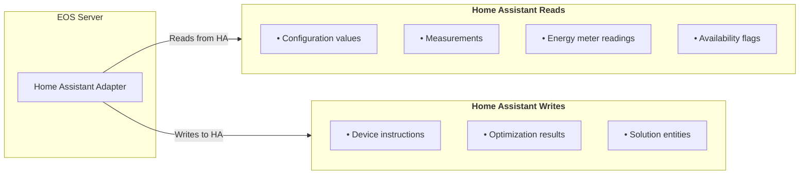
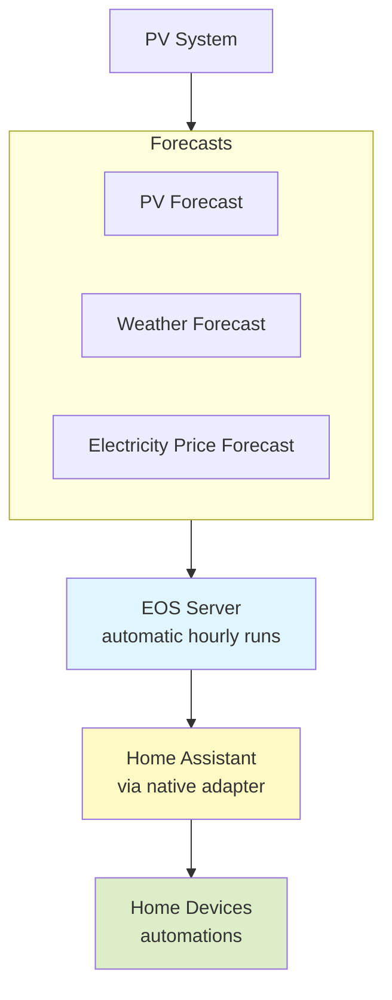

% SPDX-License-Identifier: Apache-2.0
(operator-guide-page)=

# Akkudoktor-EOS Operator Guide

Practical Installation & Configuration

This guide explains how to install and configure **Akkudoktor-EOS (Energy
Optimization System)** and set up a typical home energy optimization scenario.

EOS optimizes energy usage based on predictions for electricity prices, PV
production, weather, and load. It generates schedules for devices like
batteries, EV chargers, heat pumps, and household loads, and now offers
**automatic, continuous optimization** with a user-friendly web dashboard
(**EOSdash**).

---

## 1. System Overview

EOS consists of several components:

| Component | Description |
|---|---|
| EOS Server | REST API backend (handles predictions, optimization) |
| EOSdash | Web dashboard – primary user interface for configuration and monitoring |
| Prediction modules | Weather, PV, electricity price |
| Simulation modules | Device and energy system simulation |
| Optimization engine | Generates optimal schedules (runs automatically) |

Typical optimization inputs:

- PV production forecast
- electricity price forecast
- weather forecast
- household load forecast

These predictions form the basis for the optimization process. The optimization
now runs **automatically in the background**; manual triggering via API is no
longer required for normal operation.

---

## 2. Requirements

Minimum system requirements:

- Python **3.11+** (if installing from source)
- Linux, macOS or Windows
- CPU: `amd64` or `arm64`
- 2-4 GB RAM recommended

**Recommended**:

- Home Assistant (for easy integration)
- Docker (for standalone deployment)

---

## 3. Installation

:::{admonition} Looking for detailed installation steps?
:class: tip
The [Installation Guide](install-page) provides in-depth instructions for all
installation methods, including prerequisites, troubleshooting, and advanced
options. Below is a summary of the most common approaches.
:::

### 3.1 Recommended: Home Assistant Add‑On

For most users, the **Home Assistant Add‑On** is the simplest way to run EOS.
It bundles EOS server, EOSdash, and automatic updates.

1. Ensure your Home Assistant instance has the official add‑on repository
   enabled (or add the Akkudoktor repository).
2. Find **Akkudoktor-EOS** in the add‑on store and click **Install**.
3. Start the add‑on and navigate to **EOSdash** (usually via a sidebar entry or
   `http://<your-ha>:8504`).

> **Note**: The add‑on automatically configures network settings and integrates
> with Home Assistant’s authentication system. Configuration is done entirely
> through EOSdash.

For a step‑by‑step walkthrough, see
[Installation in Home Assistant](install-page) in the installation guide.

### 3.2 Alternative: Docker Installation

If you do not use Home Assistant, you can run EOS via Docker:

```bash
docker pull akkudoktor/eos:latest
docker run -d \
  --name akkudoktoreos \
  -p 8503:8503 \
  -p 8504:8504 \
  -e EOS_SERVER__HOST=0.0.0.0 \
  -e EOS_SERVER__EOSDASH_HOST=0.0.0.0 \
  -e EOS_SERVER__EOSDASH_PORT=8504 \
  akkudoktor/eos:latest
```

Access services:

| Service   | URL                                                      |
| --------- | -------------------------------------------------------- |
| REST API  | [http://localhost:8503](http://localhost:8503)           |
| API Docs  | [http://localhost:8503/docs](http://localhost:8503/docs) |
| Dashboard | [http://localhost:8504](http://localhost:8504)           |

For more options (e.g., using Docker Compose, setting ulimits, or persistent
volumes), refer to the [Docker installation sections](install-page) of the
installation guide.

### 3.3 Installation from Source (for development)

Only recommended if you intend to modify EOS.

The [Installation from Source](install-page) section covers prerequisites,
virtual environment setup, and running EOS in more detail.

---

## 4. Configuration Basics

EOS configuration is stored in `EOS.config.json` but **you rarely need to edit
this file manually**. The primary interface for configuration is **EOSdash**,
which provides a user‑friendly way to set up:

- Location (latitude, longitude)
- Prediction providers (electricity price, PV forecast, weather)
- System components (battery, inverter, etc.)
- Optimization parameters

Changes made in EOSdash (and therefore EOS) are **not** saved automatically to
the configuration file. Use the admin panel of EOSdash to save the current
configuration to the configuration file. You can also import/export
configurations via the dashboard.

> **Legacy note**: Previously, the `/optimize` endpoint was used to trigger an
> optimization. Today, EOS runs optimizations continuously (e.g., every hour)
> without manual intervention. The dashboard displays the latest results and
> schedules.

For comprehensive details on configuration options and file locations, see the
[Configuration Guideline](https://akkudoktor-eos.readthedocs.io/en/stable/akkudoktoreos/configuration.html).

---

## 5. Configuration File Locations (if you need to know)

EOS searches for the config file in this order:

1. `EOS_CONFIG_DIR`
2. `EOS_DIR`
3. platform default directory
4. current working directory

Example:

```bash
export EOS_DIR=/opt/eos
```

Environment variables can still override settings (see next section), but most
users will configure everything via EOSdash.

---

## 6. Environment Variables (Advanced)

All configuration parameters can also be set via environment variables:

```text
EOS_<SECTION>__<KEY>
```

Example:

```bash
EOS_SERVER__HOST=0.0.0.0
EOS_SERVER__PORT=8503
EOS_SERVER__EOSDASH_PORT=8504
```

Nested configuration values use `__`.

---

## 7. Typical EOS Configuration (Example)

A minimal configuration example (as it would appear in the JSON file – normally
you’d enter these values in EOSdash):

```json
{
  "general": {
    "latitude": 48.1,
    "longitude": 11.6
  },

  "server": {
    "host": "0.0.0.0",
    "port": 8503,
    "startup_eosdash": true,
    "eosdash_port": 8504
  },

  "weather": {
    "provider": "WeatherImport"
  },

  "pvforecast": {
    "provider": "PVForecastImport"
  },

  "elecprice": {
    "provider": "ElecPriceAkkudoktor",
    "charges_kwh": 0.05
  }
}
```

---

## 8. Prediction Providers

EOS uses providers for forecast data. Available prediction categories include:

| Prediction        | Description               |
| ----------------- | ------------------------- |
| Weather           | temperature, wind etc     |
| PV forecast       | predicted PV generation   |
| Electricity price | market electricity prices |
| Load forecast     | household demand          |

Prediction data is stored internally in a key-value store. In EOSdash you can
select which provider to use for each category and, if needed, upload custom
forecast files.

For a deeper dive into prediction providers and how to configure them, consult
the
[Predictions documentation](https://akkudoktor-eos.readthedocs.io/en/latest/akkudoktoreos/prediction.html).

---

## 9. Electricity Price Configuration

Example (as seen in EOSdash):

- **Provider**: Akkudoktor price provider (retrieves day‑ahead prices)
- **Charges**: €0.05 per kWh (grid usage fee)

Corresponding JSON snippet:

```json
"elecprice": {
  "provider": "ElecPriceAkkudoktor",
  "charges_kwh": 0.05
}
```

---

## 10. PV Forecast Configuration

Example:

```json
"pvforecast": {
  "provider": "PVForecastImport",
  "provider_settings": {
    "import_file_path": "/data/pvforecast.json"
  }
}
```

In EOSdash you can either upload a PV forecast file or configure a live
provider (e.g., Solcast).

---

## 11. Weather Forecast Configuration

Example:

```json
"weather": {
  "provider": "WeatherImport",
  "provider_settings": {
    "import_file_path": "/data/weather.json"
  }
}
```

Again, EOSdash simplifies this: choose a provider, enter API keys if needed, or
upload a file.

---

## 12. Home Assistant Automation Guide

This section provides a comprehensive guide to integrating EOS with Home
Assistant using the native **Home Assistant adapter** built directly into
Akkudoktor-EOS. This adapter provides a seamless, bidirectional interface
between the two systems without requiring additional tools.

### 12.1 Understanding the Native Integration Approach

The Home Assistant adapter creates a clean separation of responsibilities while
enabling tight integration:

| System | Responsibility |
|--------|----------------|
| **EOS** | Strategic planning: forecasts, simulations, long‑term optimization (24‑48 hours) |
| **Home Assistant** | Tactical execution: real‑time device control, automations, user interface |

**EOS does not directly control devices** – it provides structured optimization
results, while Home Assistant remains responsible for executing the actual
control actions. This separation keeps the integration flexible and
maintainable.

### 12.2 How the Adapter Works: Bidirectional Data Exchange

The Home Assistant adapter enables two-way communication:



**Before each energy management run**, EOS reads configuration data and
real-time measurements from Home Assistant entity states. **After each
optimization run**, EOS publishes results by writing states and attributes back
to Home Assistant entities.

### 12.3 Configuration Steps

#### In EOS

1. **Enable and configure the Home Assistant adapter** – EOS must be configured
   with access to the Home Assistant API. When running EOS as a Home Assistant
   add-on, this is automatically configured.

2. **Define source entity IDs** – Configure which Home Assistant entities EOS
   should read:
   - Configuration entities (battery capacity, max charge power, etc.)
   - Measurement entities (current SoC, power readings)
   - Energy meter readings (grid import/export, PV production)

3. **Define target entity IDs** – Configure where EOS should write results:
   - Device instruction entities (battery mode, EV charging state)
   - Solution/optimization result entities

#### In Home Assistant

1. **Entities created by EOS appear automatically** – Once EOS writes results,
   the entities appear in Home Assistant's state machine.

2. **Create template sensors for UI usability** – Entities created by EOS have
   no unique ID. To use them properly in dashboards, history, or automations,
   wrap them in template sensors.

```yaml
template:
  - sensor:
      - name: "Battery1 Operation Mode"
        unique_id: "battery1_op_mode"
        state: >
          
          {{ battery1_op_mode }}
        state_class: measurement
```

### 12.4 Data Exchange Details

#### Data EOS Reads from Home Assistant

| Data Type | Purpose | Example Entities |
|-----------|---------|------------------|
| **Configuration values** | Device modelling | Battery capacity, max charge power |
| **Measurements** | Initial device state | Current SoC, power consumption |
| **Energy meter readings** | Forecast correction | Grid import/export, PV production |
| **Availability flags** | Device status | Binary sensor states |

#### Data EOS Writes to Home Assistant

**Device instruction entities** – After each optimization run, EOS produces
device instructions:

| Entity ID | Description |
|-----------|-------------|
| `sensor.eos_battery1` | Battery operation mode (e.g., "charge", "discharge", "idle") |
| `sensor.eos_ev1` | EV charging mode |
| `sensor.eos_heatpump1` | Heat pump operation mode |

Entity attributes provide additional parameters like `operation_mode_factor`,
power limits, or mode-specific control settings.

**Solution entities** – EOS publishes solution-level details:

| Entity ID | Description |
|-----------|-------------|
| `sensor.eos_total_cost` | Projected total energy cost |
| `sensor.eos_self_consumption` | Expected self‑consumption rate |
| `sensor.eos_grid_import` | Predicted grid import |

### 12.5 Value Conversion with Template Sensors

When reading configuration values and measurements from entity states, the
adapter applies heuristics to convert Home Assistant states into suitable EOS
values. However, it's **recommended to use template sensors** for value
conversion to keep the integration clean and consistent.

#### Example: Battery SoC Conversion

Convert a battery state of charge from percentage (0–100) to a normalized
factor (0.0–1.0):

```yaml
template:
  - sensor:
      - name: "Battery1 SoC Factor"
        unique_id: "battery1_soc_factor"
        state: >
          
          {{ bat_charge_soc / 100.0 }}
        state_class: measurement
```

#### Boolean Conversion Reference

| Type | Values |
|------|--------|
| Boolean True | `"y"`, `"yes"`, `"on"`, `"true"`, `"home"`, `"open"` |
| Boolean False | `"n"`, `"no"`, `"off"`, `"false"`, `"closed"` |
| None | `"unavailable"`, `"none"` |

### 12.6 Automation Examples

#### Example 1: Battery Control Based on EOS Schedule

```yaml
alias: "EOS Battery Control"
trigger:
  - platform: state
    entity_id: sensor.eos_battery1    # Trigger when EOS updates
condition: []
action:
  - choose:
      - conditions:
          - condition: state
            entity_id: sensor.eos_battery1
            state: "charge"
        sequence:
          - service: mqtt.publish
            data:
              topic: "inverter/command"
              payload: "charge"
      - conditions:
          - condition: state
            entity_id: sensor.eos_battery1
            state: "discharge"
        sequence:
          - service: mqtt.publish
            data:
              topic: "inverter/command"
              payload: "discharge"
      - conditions:
          - condition: state
            entity_id: sensor.eos_battery1
            state: "idle"
        sequence:
          - service: mqtt.publish
            data:
              topic: "inverter/command"
              payload: "idle"
mode: single
```

#### Example 2: Dynamic Electricity Price Notification

This example assumes EOS writes price forecasts to attributes of a solution
entity.

```yaml
alias: "Cheap Electricity Alert"
trigger:
  - platform: time_pattern
    hours: "/1"    # Check every hour
condition:
  - condition: template
    value_template: >
      
      
        {{ prices | min < 0.10 }}    # Alert if any hour below €0.10/kWh
      
        false
      
action:
  - service: notify.mobile_app
    data:
      title: "Cheap Electricity Tomorrow"
      message: "Lowest price: {{ (prices | min * 100) | round(1) }} ct/kWh"
mode: single
```

#### Example 3: EV Charging Automation

```yaml
alias: "EOS EV Smart Charging"
trigger:
  - platform: state
    entity_id: sensor.eos_ev1
condition:
  - condition: state
    entity_id: binary_sensor.ev_plugged_in
    state: "on"
  - condition: template
    value_template: "{{ states('sensor.eos_ev1') == 'charge' }}"
action:
  - service: switch.turn_on
    target:
      entity_id: switch.ev_charger
mode: single
```

### 12.7 Key Principles to Remember

- **EOS does not directly control devices** – It provides structured
  optimization results; Home Assistant executes the actual control actions.
- **Home Assistant remains the authoritative source** for measurements and
  configuration. EOS always reads this data from HA.
- **Entities created by EOS have no unique ID** – Always wrap them in template
  sensors for use in dashboards and automations.
- **Use template sensors for value conversion** – This keeps the integration
  clean and adapts HA values to EOS expectations.

### 12.8 Troubleshooting

<!-- pyml disable line-length -->
| Issue | Solution |
|-------|----------|
| No EOS entities appearing | Verify HA adapter enabled in EOS and optimization run completed. |
| Entities show "unavailable" | Wrap in template sensors with unique IDs for UI integration. |
| Values seem incorrect | Check unit conversions; use template sensors for scaling (e.g., percentage→factor). |
| Battery control not working | Confirm your inverter accepts commands via Home Assistant. Test with a simple automation first, then integrate the EOS condition. |
<!-- pyml enable line-length -->

---

## 13. Integration with External Systems (Beyond Home Assistant)

EOS can also integrate with other automation platforms via its REST API.

### Node-RED

- Use HTTP Request nodes to fetch optimization results and control devices via
  MQTT.

### Direct API Calls

Example API call (if needed for debugging):

```http
POST /v1/optimization/run
```

> **Note**: With automatic optimization, manual triggering is rarely required.

---

## 14. Verify Operation

- Open **EOSdash** (`http://<your-eos>:8504` or via Home Assistant sidebar).
- Check the dashboard for prediction data and optimization results.
- If you see no data, verify that your prediction providers are correctly
  configured in EOSdash.

You can also use the API:

```text
http://localhost:8503/docs
```

Check prediction keys:

```http
GET /v1/prediction/keys
```

If no keys appear, prediction providers are not configured correctly.

---

## 15. Troubleshooting

### EOS does not start

- **Home Assistant add‑on**: Check the add‑on logs in the Home Assistant
  interface.
- **Docker**: Run `docker logs akkudoktoreos`.

### Dashboard not accessible

- Verify port mapping (`-p 8504:8504` for Docker).
- Ensure the add‑on is started and network settings are correct.

### No optimization results

Common causes in EOSdash:

- Missing or misconfigured prediction providers.
- System description (battery, inverter) not defined.
- No measurement inputs (e.g., current PV power, load) available.

---

## 16. Example Deployment Architecture

Typical home setup with automatic optimization and Home Assistant integration:



---

## 17. Useful API Endpoints (for advanced users)

| Endpoint               | Purpose                              |
| ---------------------- | ------------------------------------ |
| `/docs`                | Interactive API documentation        |
| `/v1/config`           | Read/update configuration (JSON)     |
| `/v1/config/file`      | Save current config to file          |
| `/v1/config/reset`     | Reload config from file              |
| `/v1/prediction/keys`  | List all available prediction keys   |
| `/v1/optimization/results` | Get latest optimization results (schedules) |

---

## Resources

- **Documentation**:
  [https://akkudoktor-eos.readthedocs.io](https://akkudoktor-eos.readthedocs.io)
- **GitHub Repository**:
  [https://github.com/Akkudoktor-EOS/EOS](https://github.com/Akkudoktor-EOS/EOS)
- **Akkudoktor Forum**: [https://akkudoktor.net](https://akkudoktor.net)
  (community support)
